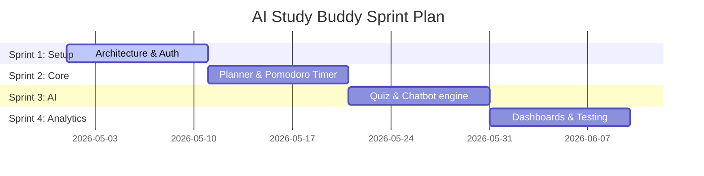

# Software Process Model & Lehman's Laws Analysis

This document details the software development process, requirements gathering, and evolutionary justifications for the **AI Study Buddy** project.

---

## 1. Process Model: Agile/Scrum Methodology

For this semester project, the development team selected the **Agile/Scrum** methodology. 

### Why Agile Was Selected
1. **Changing Requirements**: AI tutoring behaviors and student analytics parameters are highly subjective and required multiple visual iterations based on user testing.
2. **Early Feedback**: It allowed the team to present a working prototype of the Pomodoro timer and chat module to users early in the cycle, validating engagement.
3. **Risk Mitigation**: Splitting features into logical increments minimized the risk of having a non-functional submission at the end of the semester.

### Scrum Sprint Plan

The project was executed across **four distinct sprints** (each lasting 1-2 weeks):

#### Sprint 1: Foundation & Authentication
* **Objective**: Establish codebase architecture, SQLite schema definition, and secure login modules.
* **Deliverables**: JWT tokens, password hashing backend, database models, and registration views.
* **Sprint Review**: Verified that the login view blocks unauthorized access and successfully registers new study accounts.

#### Sprint 2: Planner & Focus Timer
* **Objective**: Create the smart study scheduler and integrate the Pomodoro focus timer.
* **Deliverables**: Tasks CRUD APIs, Pomodoro circle face timer, and automatic study logging endpoints.
* **Sprint Review**: Verified that completing a Pomodoro session automatically triggers a database StudyLog entry and updates task completion counts.

#### Sprint 3: AI Chatbot & Quiz Generator
* **Objective**: Implement the local AI tutoring services and practice questions generator.
* **Deliverables**: Keyword chatbot matching, subject quiz generator, score sheets, and AI recommendations engine.
* **Sprint Review**: Tested quiz selections across Computer Science, Math, and Software Engineering, verifying that results render explanatory chimes.

#### Sprint 4: Performance Analytics & Quality Assurance
* **Objective**: Develop the visual progress dashboard, add unit tests, perform code inspections, and prepare deployment.
* **Deliverables**: Weekly visual bar graphs, PyTest unit suites, and GitHub Actions CI pipelines.
* **Sprint Review**: Final system inspection confirming 100% build rates.

---

## 2. Requirement Gathering (User Stories)

We gathered specifications from student user stories:
* **User Story 1 (Planner)**: *As a student, I want to add tasks and tag them by subject so that I can keep my semester studies organized.*
* **User Story 2 (Focus)**: *As a student, I want to run a Pomodoro timer directly linked to my planner tasks so that I can track my exact focus minutes.*
* **User Story 3 (Assessment)**: *As a student, I want to generate practice quizzes from subject areas and see immediate feedback so that I can practice active recall.*
* **User Story 4 (Analytics)**: *As a student, I want to see a visual chart of my study time over the past week so that I can evaluate my productivity.*

---

## 3. Lehman’s Laws of Software Evolution Justification

Lehman's Laws describe how software systems behave as they evolve over time. The lifecycle of the **AI Study Buddy** illustrates these laws:

### Law I: Continuing Change (Evolution)
* **Definition**: *An E-type system must undergo continuous adaptation or it becomes progressively less useful.*
* **Justification**: Initially, the application was just a simple task list. However, users requested interactive study aids (like the Pomodoro timer and quiz generator). To remain useful in a university setting, the application had to adapt, incorporating local AI rule systems to respond to conversational prompts.

### Law II: Increasing Complexity
* **Definition**: *As an E-type system evolves, its complexity increases unless work is done to maintain or reduce it.*
* **Justification**: As we added study logging, user streaks, and analytics, the code database became messy. The original single-file prototype (`spaghetti_app_bad.py`) became unmanageable. To combat this complexity, we performed a major refactoring step, adopting modular blueprints and ORM models to maintain codebase sanity.

### Law III: Self Regulation
* **Definition**: *Global system evolution processes are self-regulating.*
* **Justification**: During Scrum Sprints, the team's velocity stabilized. If we tried to implement too many features in Sprint 2, the testing failure rate rose, forcing the team to reduce scope in Sprint 3 to stabilize the build. The output rate remained constant across the project life.

### Law IV: Conservation of Familiarity (Organizational Stability)
* **Definition**: *The work rate is invariant on average across the system lifetime.*
* **Justification**: To prevent development slowdowns, we kept the database schema interfaces and model signatures consistent. When we added AI recommendations in Sprint 3, we leveraged the existing `Task` and `StudyLog` tables rather than creating a convoluted database layer, conserving familiarity for the development team.
