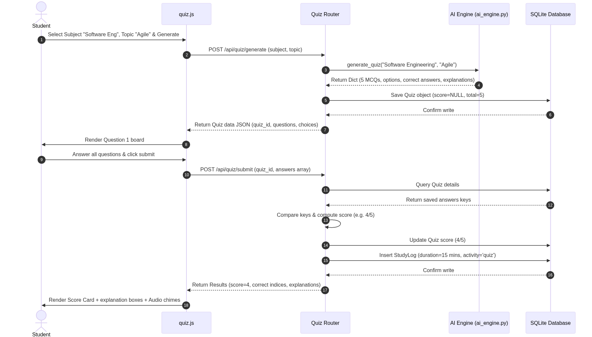
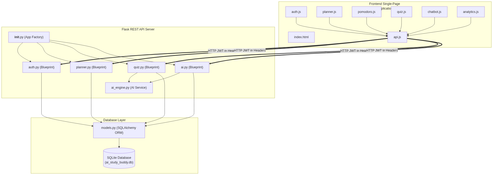
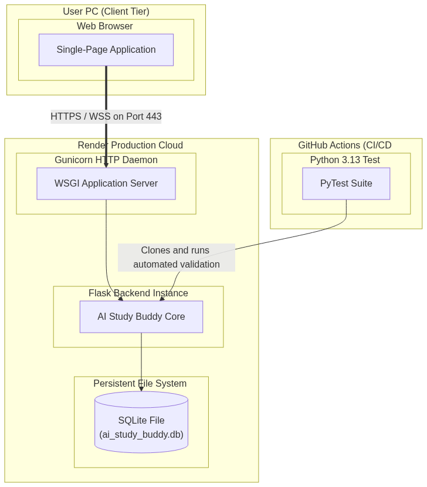

# System Architecture Overview & Diagrams Report

This document details the system design, object models, information sequences, component interfaces, and deployment topologies of the **AI Study Buddy** application. The visual models referenced here are stored inside the project's [docs/uml/](file:///d:/final-project/docs/uml/) folder.

---

## 1. System Architecture Summary

The **AI Study Buddy** application is built using a classic **Client-Server 3-Tier Web Architecture**:
1.  **Presentation Tier**: The client-side Single-Page Application (SPA) executed in the user's browser. It uses responsive layouts and local timers to drive interactive feedback loops.
2.  **Application Tier**: A Python Flask REST API server. It coordinates endpoints, manages authentication states using JWT tokens, handles business logic, and delegates prompts to the AI rule engine.
3.  **Data Tier**: A relational SQLite database accessed using SQLAlchemy ORM for schema consistency.

---

## 2. Object Design & Database Schema

The system object design focuses on tracking student history and progress across different study activities.


### Schema Classes & Relationships
*   **User Class**: Serves as the central security entity. It maintains basic credentials (password hashes generated via `bcrypt`), student focus streaks, and daily study targets.
*   **Task Class**: Represents academic tasks. It contains fields for subjects, target pomodoro estimates, and current pomodoro progress. It has a **composition relationship** with the `User` class (a task cannot exist without an owner).
*   **Quiz Class**: Models student assessments. It stores a JSON object of mock exam questions and the student's score.
*   **StudyLog Class**: A transaction table logging all student focus activities. The system automatically inserts a log whenever a student completes a task, submits a quiz, or uses the chatbot tutor.
*   **AIEngine Class**: A service-layer component containing rule-based logic for quiz generation, tutoring chatbot dialogue, and personalized recommendation heuristics.

---

## 3. Sequence Diagrams & Transaction Flows

The application's core workflows are documented below:

### 3.1 Authentication & Profile Handling
Authentication is implemented using stateless **JSON Web Tokens (JWT)**.
*   **Register Flow**: User enters credentials $\rightarrow$ server hashes password $\rightarrow$ database inserts row $\rightarrow$ server signs JWT containing the `user_id` $\rightarrow$ client caches JWT in LocalStorage.
*   **Login & API Usage**: Client attaches JWT to the `Authorization` header. The server verifies the signature, queries the database, and returns the profile details.


### 3.2 Task Management & Focus Timer Integration
This sequence coordinates task tracking with a local Pomodoro timer:
*   Student selects a task $\rightarrow$ planner routes parameters to the Pomodoro timer $\rightarrow$ completion of the 25-minute timer triggers an auto-logged 25-minute study log to the AI system and increments the completed pomodoro counter on the active task.


### 3.3 Mock Examination Generation & Scoring
This sequence manages the interactive self-assessment process:
*   Student inputs topic $\rightarrow$ AI generates 5 multiple choice questions $\rightarrow$ student submits responses $\rightarrow$ database grades quiz $\rightarrow$ database logs 15-minute study log.



### 3.4 Conversational Tutoring
The chatbot flow supports interactive learning using the Feynman Technique:
*   Student queries chatbot $\rightarrow$ AI parses query $\rightarrow$ database logs 1-minute study log to capture the interaction.


---

## 4. Component Architecture

The component architecture details the structural dependencies between modules, tracking the boundary lines between presentation layers and backend code:



### Logical Modules
*   **Frontend SPA Module**: Features modules (`auth.js`, `planner.js`, `quiz.js`, etc.) coordinated by a central `api.js` client wrapper.
*   **Flask REST Controller Module**: Map routes using Flask Blueprints and routes input requests to services.
*   **AI Engine Service Module**: Processes chatbot requests, mock quizzes, and study suggestions.
*   **SQLAlchemy DB Service Module**: Connects model properties directly to SQLite tables.

---

## 5. Physical Deployment Architecture

The physical deployment architecture defines the system's hosting environments, infrastructure tiers, and pipeline controls:



### Target Platforms
*   **Client Tier**: Runs standard browsers executing the SPA assets.
*   **Render Application Container**: Runs an Ubuntu Linux image hosting a Gunicorn WSGI process manager. It connects to a persistent SQLite database stored on the container's disk.
*   **CI/CD Pipeline Tier**: Runs on GitHub Actions VMs on pull request or push hooks to verify code modifications.

---

## 6. Continuous Integration & CD Pipeline Summary

The repository includes a GitHub Actions CI/CD configuration inside `.github/workflows/ci.yml`.

```yaml
name: Flask CI Pipeline
on: [push, pull_request]
jobs:
  test:
    runs-on: ubuntu-latest
    steps:
      - uses: actions/checkout@v4
      - name: Set up Python
        uses: actions/setup-python@v5
        with:
          python-version: '3.13'
      - name: Install dependencies
        run: pip install -r backend/requirements.txt
      - name: Run PyTest
        run: pytest backend/tests/
```

This automated check executes unit tests on push and pull requests. When a test suite run succeeds, the repository triggers a webhook that starts a one-click deployment on Render.
