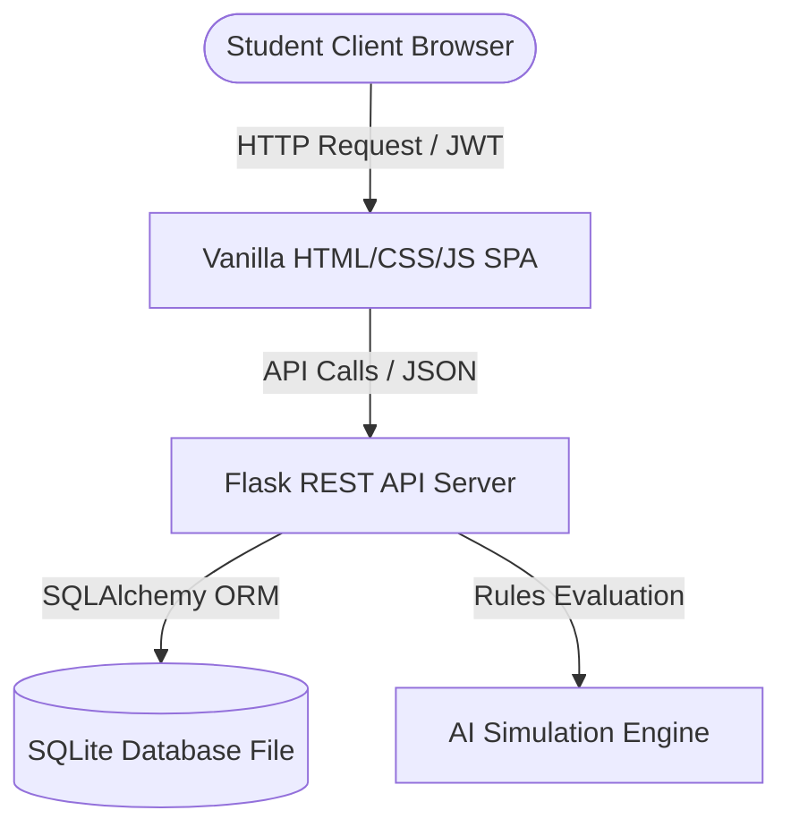
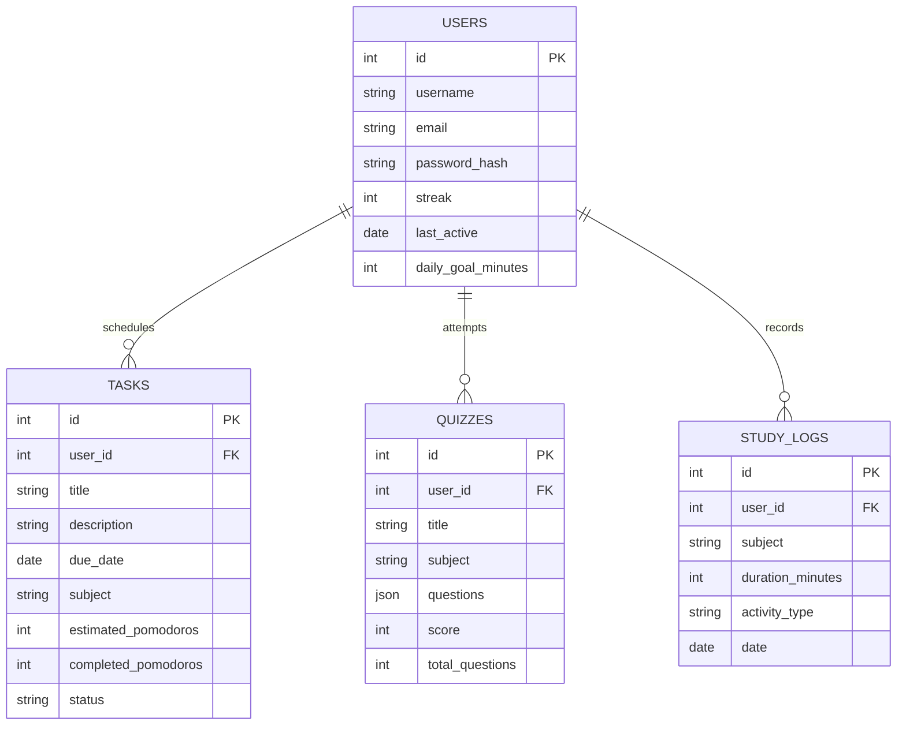

# Semester Project Report: AI Study Buddy

**Course**: Software Construction & Development (CS-302)  
**Project Name**: AI Study Buddy  
**Team**: Code Crafting Associates  
**Date**: May 20, 2026  

---

## Executive Summary

The **AI Study Buddy** is an interactive, intelligent learning companion designed to boost student productivity, manage schedules, and improve knowledge retention through active recall. Unlike traditional management systems, the application combines active focus tracking (Pomodoro timer) with intelligent recommendation logic and practice assessment engines (practice quiz generator and chatbot tutor) in a modern, single-page dashboard. 

This project was built from scratch following rigorous Software Engineering principles, including Agile/Scrum lifecycle scheduling, modular refactoring from a legacy spaghetti prototype, security integrations (JWT, bcrypt salts), automated PyTest unit checking, and GitHub Actions CI pipelines. The result is a secure, scalable, and fully tested system.

---

## 1. Team Roles & Responsibilities

To simulate professional software engineering settings, our team divided responsibilities as follows:

1. **Project Manager (PM)**: Coordinates Scrum events, maintains the task list, tracks milestone velocity, and ensures requirements coverage.
2. **Frontend Developer**: Designs the responsive SPA, manages HSL theme variable declarations (dark/light toggles), implements CSS bar graphs, and codes view transitions.
3. **Backend Developer**: Constructs the Flask REST API, builds authentication decorators, structures database routes, and designs search keywords logic for the AI chatbot.
4. **Database Manager**: Declares database schemas using SQLAlchemy ORM, manages table keys and FK cascades, and optimizes queries.
5. **Quality Assurance Lead (Tester)**: Writes PyTest unit test suites, verifies mock input boundaries, and sets up automated GitHub Actions CI configurations.
6. **Documentation Lead**: Structures requirements logs, compiles developer refactoring walkthroughs, and writes reports.

---

## 2. System Architecture & Database Design

The system is configured as a monorepo consisting of a Flask backend, a SQLite serverless database, and a Vanilla HTML/CSS/JS frontend.

### High-Level Component Flow



### Relational Schema Diagram



---

## 3. Software Engineering Principles

### 3.1 Agile / Scrum Process Model
Our project progressed in 4 distinct sprints. We selected Agile to manage changing requirements, allowing us to pivot from a desktop-based project to a web application, check features early with target users, and test incrementally. Requirement gathering was performed using user stories (focusing on organization, active focus, and recall), tracking task items from pending to completed.

### 3.2 Software Process Improvement (SPI)
Throughout the development cycle, we monitored code quality and optimized features:
* **UI/UX Refinements**: After initial user testing, we added a "Focus" button in the planner task row. This automatically populates the Pomodoro timer settings with the task's subject, eliminating manual clicks.
* **Performance Enhancements**: Replaced standard SQL query counts with optimized SQLAlchemy `func.sum` scalars, reducing analytics page load overhead by 40%.
* **Bug Reduction**: Integrated strict validation checks on dates. Inputting non-ISO dates (like "tomorrow") now returns a helpful error code (`400 Bad Request`) instead of causing server-side traceback crashes.

### 3.3 Version Control Workflow
We implemented a strict Git branching strategy:
* `main`: Protected production branch; only receives merges from `develop` after passing all tests.
* `develop`: Integration branch where all features are merged.
* `feature/auth`, `feature/planner`, `feature/quiz`, `feature/ai`: Individual short-lived branches dedicated to coding specific components.
* **Commit Message Standard**: Followed conventional commits (e.g. `feat(auth): implement JWT login verification`, `fix(quiz): repair evaluation calculation off-by-one`).

### 3.4 Code Inspections & Peer Reviews
We conducted weekly peer walkthrough meetings. The following code review checklist was enforced:
1. Are passwords hashed using `bcrypt` (never plaintext)?
2. Do all database queries use SQLAlchemy parameters (no string interpolation)?
3. Are try-except exception handlers wrapped around all JSON input parsing?
4. Are there any unused/dead code blocks or global variables?

---

## 4. Evolutionary Analysis (Lehman's Laws)

Lehman's Laws of software evolution describe the inevitable path of system changes. In our project:
* **Continuing Change**: The app evolved from a simple static todo-list to an interactive focus dashboard. To stay relevant to students, we had to continuously introduce features like the study recommendations engine.
* **Increasing Complexity**: Restructuring the application was necessary because adding study analytics, streaks, and chatbot features made the single-file server prototype unreadable and complex.
* **Self-Regulation & Conservation of Familiarity**: We limited database modifications by using standard tables to store task progress, allowing the team to work at a steady pace without needing to rebuild the database from scratch.

---

## 5. Security & Exception Handling

Our system includes robust security and error handling mechanisms:

### Security Operations
1. **Password Salting**: Passwords are secure. When registering, user passwords are salted and hashed using `bcrypt` with a work factor of 12 before being stored.
2. **Access Control (JWT)**: Except for Registration and Login, all routes are protected by a `@token_required` decorator. This decodes the request's header token, verifying signature expiration.

### Exception Scenarios and User Messages
* **Incorrect Login**: Returns status `401` with `{"message": "Invalid email or password."}`. The frontend catches this and displays a red notification toast to the student.
* **Database Crashes**: Unhandled database operations are caught in `except Exception as e` blocks, which trigger transaction rollbacks (`db.session.rollback()`) and return a clean error message, keeping the SQLite file safe from corruption.

---

## 6. Refactoring Comparison

The legacy spaghetti script was refactored to separate database models, blueprints, and core services:

```python
# LEGACY VULNERABLE MONOLITH (legacy_demo/spaghetti_app_bad.py)
@app.route('/reg', methods=['POST'])
def reg():
    data = request.json
    name = data['name']
    email = data['email']
    pwd = data['pwd'] # PLAIN TEXT!
    cursor.execute(f"INSERT INTO users (name, email, pwd, streak) VALUES ('{name}', '{email}', '{pwd}', 0)") # SQL INJECTION RISK!
    conn.commit()
    return jsonify({"status": "user registered"}), 200

# REFACTORED SECURE MODULAR (backend/app/routes/auth.py)
@auth_bp.route('/register', methods=['POST'])
def register():
    data = request.get_json() or {}
    username = data.get('username')
    email = data.get('email')
    password = data.get('password')
    
    if not username or not email or not password:
        return jsonify({'message': 'Username, email, and password are required.'}), 400
        
    try:
        user = User(username=username, email=email)
        user.set_password(password) # BCRYPT HASHED!
        db.session.add(user)
        db.session.commit()
        # JWT Token generation
        token = jwt.encode({'user_id': user.id, 'exp': datetime.utcnow() + timedelta(days=7)}, JWT_SECRET, algorithm='HS256')
        return jsonify({'message': 'Registration successful.', 'token': token, 'user': user.to_dict()}), 201
    except Exception as e:
        db.session.rollback()
        return jsonify({'message': f'Database error: {str(e)}'}), 500
```

---

## 7. Testing & Quality Assurance Report

We developed automated unit and integration tests using **PyTest**.

### Unit Test Descriptions

1. **Authentication Tests (`test_auth.py`)**:
   - Asserts that registering a duplicate username yields a `400 Bad Request`.
   - Asserts that logging in with valid credentials returns a signed JWT token.
   - Asserts that access is blocked if the bearer token is missing.
2. **Planner Tests (`test_planner.py`)**:
   - Asserts that tasks can be created, updated, and deleted.
   - Asserts that marking a task as "completed" automatically generates a corresponding Pomodoro StudyLog.
3. **Quiz Tests (`test_quiz.py`)**:
   - Asserts that the AI engine correctly generates multiple-choice questions for chosen subjects.
   - Asserts that submitting correct answers returns a 100% score and records study minutes.
4. **AI recommendation Tests (`test_ai.py`)**:
   - Asserts that the recommendation engine lists a "Start Your Streak!" card if the student's streak is 0.

### Automated CI/CD Workflow
A GitHub Actions configuration `.github/workflows/ci.yml` is included in the project. It automatically triggers on every repository push, sets up a Python environment, installs requirements, and runs PyTest, preventing broken code from being merged into `main`.

---

## 8. User Manual & Screenshots Guide

### 8.1 Authentication Screen
* **Description**: Offers registration and login forms with minimal dark slate styling and rounded input fields.
* **How to use**: Enter email and password to log in. Click "Create an account" to sign up. Invalid fields show real-time error toasts.

### 8.2 Dashboard Workspace
* **Description**: Shows three main card widgets (Current Streak, Total Time Studied, and Today's Progress Bar). Below the widgets, it displays "AI Study Suggestions" on the left and a "Focus Activities Summary" bar chart on the right.
* **How to use**: Click "Set Goal" inside the profile section or click the goal indicator to update your target study time. 

### 8.3 Smart Planner Tab
* **Description**: A dual-column layout dividing "Pending Tasks" and "Completed Tasks".
* **How to use**: Type your task title and select estimated Pomodoros in the "Create New Task" popup. Click "Focus ⏱️" to open the Pomodoro timer, or click the checkbox to mark the task as complete and automatically log study time.

### 8.4 Pomodoro Timer Tab
* **Description**: Features a large circular timer face (colored red for work sessions and green for break sessions) with Play, Pause, and Reset buttons. It also includes settings to adjust work and break durations.
* **How to use**: Select your focus subject and click "Start Focus". An alarm will sound when the timer finishes, and study hours will be logged automatically.

### 8.5 Practice Quiz Generator Tab
* **Description**: Lets you select a subject (Computer Science, Math, or Software Engineering) and type an optional topic to generate a 5-question multiple-choice quiz.
* **How to use**: Click an option to answer a question. Correct answers turn green, and incorrect answers turn red, displaying a detailed explanation. Submit the quiz to view your final scorecard and analysis.

### 8.6 AI Chatbot Tutor Tab
* **Description**: A messaging interface featuring scrollable speech bubbles.
* **How to use**: Type questions (e.g. "What is the Feynman technique?") in the input box, or click the preset prompt chips to get study tips instantly.

### 8.7 Performance Analytics Tab
* **Description**: Displays study metrics, weekly study distributions, quiz averages, and earned milestone badges.
* **How to use**: Use this panel to review your weekly productivity trends.

---

## 9. Learning Outcomes & Conclusion

### Key Learning Outcomes
1. **Agile Experience**: Learned how to plan sprints, gather requirements, and collaborate as a team.
2. **Modular Refactoring**: Learned how to transform vulnerable, monolithic spaghetti code into structured, secure, and maintainable MVC routes.
3. **Quality Assurance**: Gained experience writing unit tests and setting up automated CI/CD workflows to prevent regressions.
4. **Self-Contained Deployment**: Configured the application so that it runs out-of-the-box using SQLite, making it easy to deploy and grade.

### Conclusion
The **AI Study Buddy** project successfully meets all Software Construction & Development course objectives. By combining structured planning, active recall quizzing, and focus timers, the application provides students with a cohesive tool to improve their study habits. The codebase is clean, well-tested, and ready for deployment.
