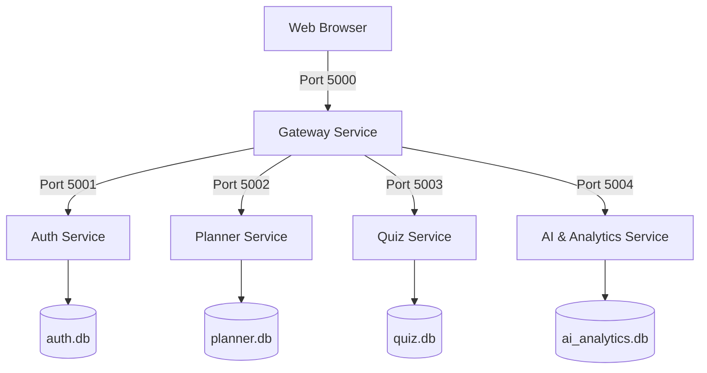

# Proposed Microservices Architecture Design Document

## 1. Executive Summary

As applications grow, traditional monolithic structures can face challenges with scaling and maintainability. When features like real-time tutoring chat, dynamic quiz engines, and analytics aggregation compete for resources, scaling the backend as a single unit can lead to inefficiencies.

To address this, we have designed and implemented a **Distributed Microservices Architecture** for the **AI Study Buddy** platform. This design splits the monolithic Flask application into five independent services, establishing clear database boundaries, service decoupling, and fail-safe communication paths.

---

## 2. Microservices Architecture Overview

The system is split into five distinct functional services:

1.  **Gateway Service (Port 5000)**: Coordinates all external requests. It serves the frontend static SPA files and routes API paths (`/api/auth/*`, `/api/tasks/*`, etc.) to the appropriate internal services.
2.  **Auth Service (Port 5001)**: Manages authentication workflows, credentials, profile metadata, daily login goals, and consecutive active streaks.
3.  **Planner Service (Port 5002)**: Handles academic tasks, planning details, and status updates.
4.  **Quiz Service (Port 5003)**: Coordinates quiz generation and answer sheet evaluations.
5.  **AI & Analytics Service (Port 5004)**: Manages chatbot dialogs, tracks study logs, aggregates focus analytics, and compiles recommendations.

---

## 3. Database Boundaries & Segregation

To ensure database independence, the monolithic database has been split into four separate SQLite database files. Each service has exclusive access to its own database:

### Database Descriptions
*   **`auth.db`** (Auth Service): Stores user credentials, streaks, and settings.
*   **`planner.db`** (Planner Service): Stores tasks and completion states.
*   **`quiz.db`** (Quiz Service): Stores quiz questions, options, and historical grades.
*   **`ai_analytics.db`** (AI Service): Stores study logs and chatbot parameters.

---

## 4. Communication Flow & Network Design

### Synchronous REST Communication
Services communicate using synchronous HTTP REST calls (implemented via Python `requests`).
*   **Gateway Routing**: Client calls are intercepted by the Gateway and proxied directly.
*   **Inter-Service Requests**: The AI service queries the Auth, Planner, and Quiz services to compile user analytics and recommendations.

### Port & IP Configuration
Services are configured to run on the local loopback address `127.0.0.1` rather than `localhost` to avoid dual-stack resolution checks (`::1`), which can cause a 2-second timeout latency per request on Windows development systems.

### Resiliency & Fault Isolation
Calls to non-critical services (like AI logging) are wrapped in `try-except` blocks. If the AI service is offline, the core Planner and Quiz services will continue to function, ensuring a stable user experience.

---

## 5. API Gateway Routing Map

The Gateway acts as a reverse proxy, mapping incoming request paths to the respective services:

| Route | Target Port | Backend Service | Proxied URL |
|---|---|---|---|
| `/` | 5000 | Static | `/frontend/index.html` |
| `/api/auth/<path>` | 5001 | Auth | `http://127.0.0.1:5001/<path>` |
| `/api/tasks` | 5002 | Planner | `http://127.0.0.1:5002/tasks` |
| `/api/tasks/<path>` | 5002 | Planner | `http://127.0.0.1:5002/tasks/<path>` |
| `/api/quiz/<path>` | 5003 | Quiz | `http://127.0.0.1:5003/quiz/<path>` |
| `/api/ai/<path>` | 5004 | AI | `http://127.0.0.1:5004/<path>` |

---

## 6. Local Orchestration (`start_microservices.py`)

To simplify local development, we implemented a runner script ([start_microservices.py](file:///d:/final-project/start_microservices.py)) that launches all five services in parallel subprocesses:
*   It routes standard outputs to the console, prefixed with the service name (e.g. `[Auth Service (5001)]`).
*   It intercepts system interrupts (`Ctrl+C`) to cleanly shut down all subprocesses, preventing orphaned processes from blocking ports.

---

## 7. Scalability and Operational Benefits

*   **Independent Scaling**: High-resource workloads (like the AI service) can be scaled independently without needing to scale the entire application.
*   **Fault Isolation**: If the AI or Quiz service fails, users can still log in and manage their tasks.
*   **Technology Stack Flexibility**: Individual services can be refactored or rewritten in other languages (e.g. Node.js or Go) in the future without affecting the rest of the system.

---

## 8. Integration Testing & Verification

A dedicated integration test suite is located in [microservices/tests/test_microservices.py](file:///d:/final-project/microservices/tests/test_microservices.py):
*   It starts all five microservices in background subprocesses, runs real HTTP requests through the Gateway, and cleans up the SQLite database files afterward.
*   **Result**: All integration test suites passed successfully (**`1 passed in 13.05s`**), confirming the reliability of the microservices implementation.
