# AI Study Buddy — UML System Architecture Diagrams

This document contains the official UML design representation for the **AI Study Buddy** application. The diagrams below model the database entities, routes, active lifecycles, and physical node layouts.

---

## 1. Class Diagram

The class diagram maps the relationships between the database model entities, route blueprints (controllers), and the rule-based AI core service.

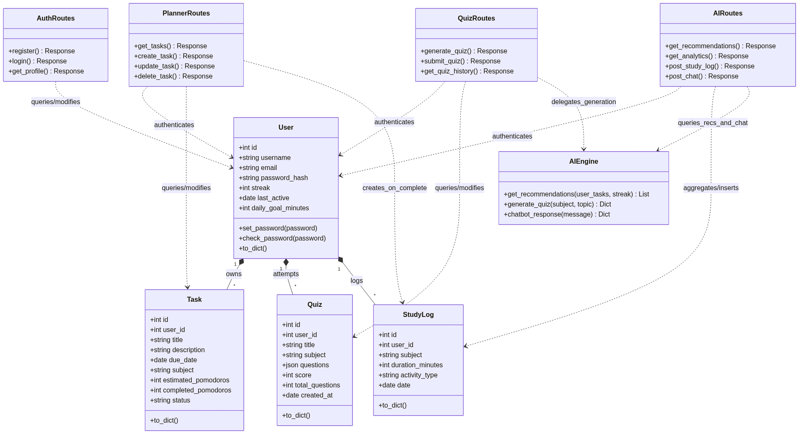

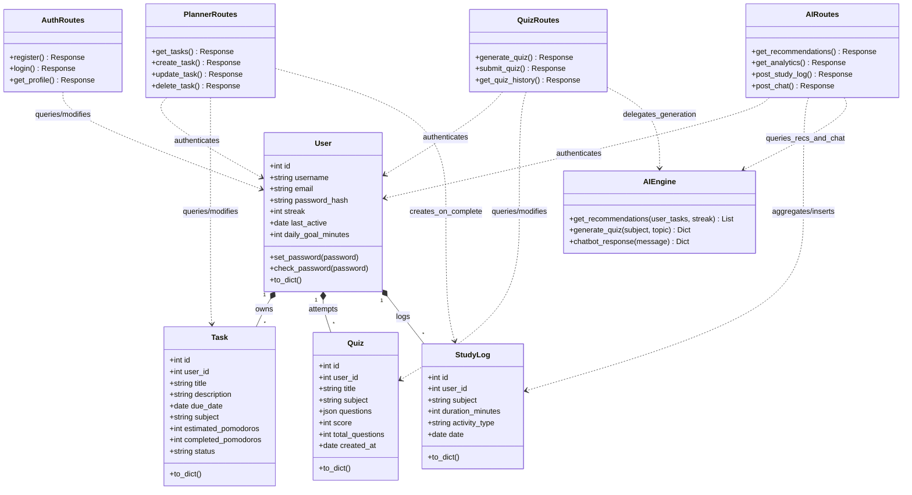

---

## 2. Sequence Diagrams

### 2.1 User Authentication Flow
This diagram details the flow of user registration/login, JWT token issuance, and subsequent authenticated sessions.

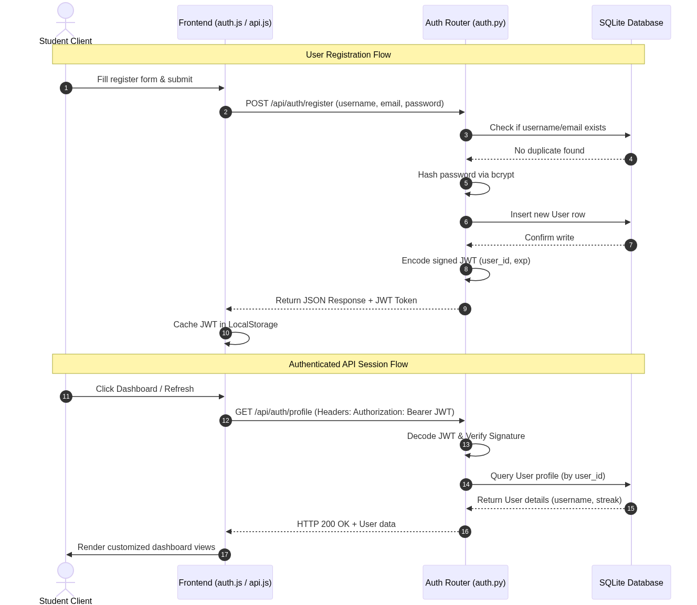

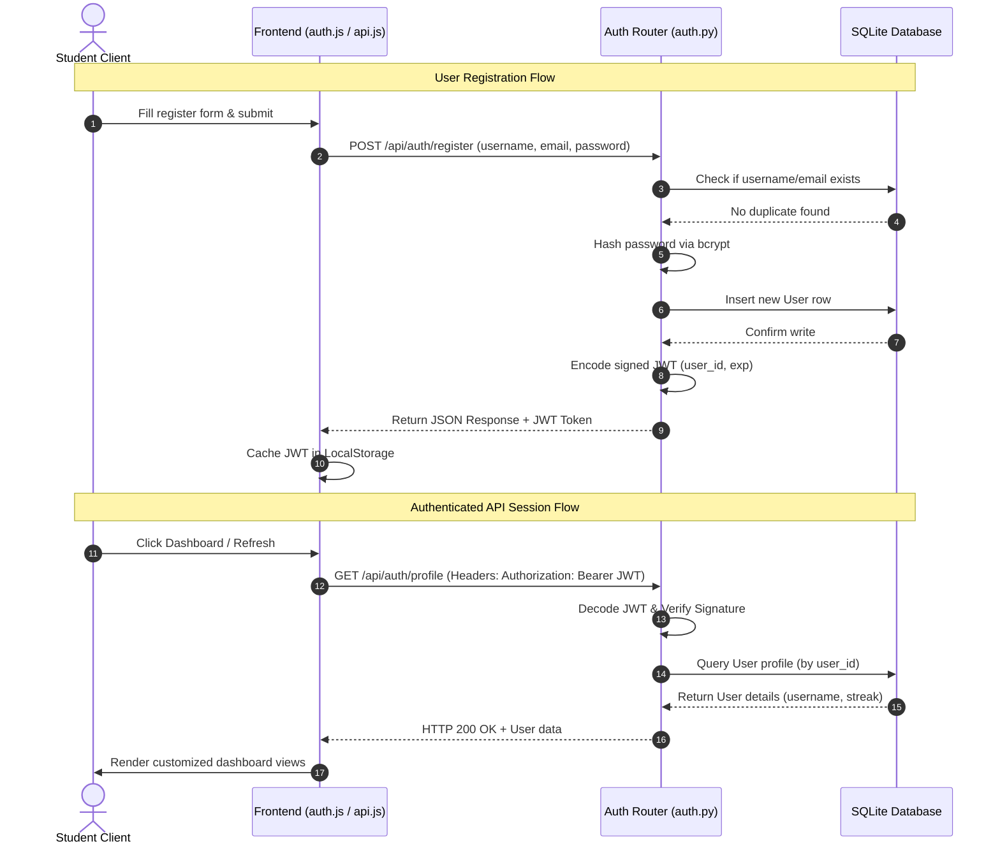

### 2.2 Task Lifecycle & Pomodoro Focus Flow
This diagram shows how creating a task leads to Pomodoro study, which subsequently triggers automatic SQL logs.

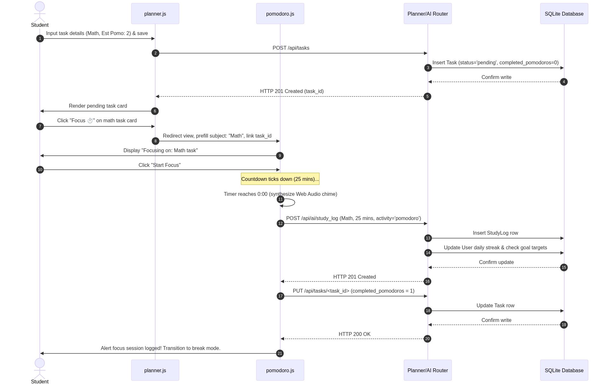

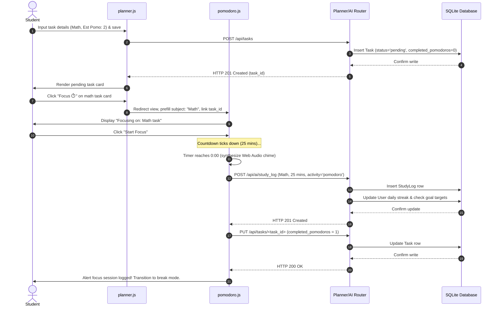

### 2.3 Interactive Practice Quiz Flow
This sequence details generating a quiz, evaluating answers, scoring, and writing study logs.

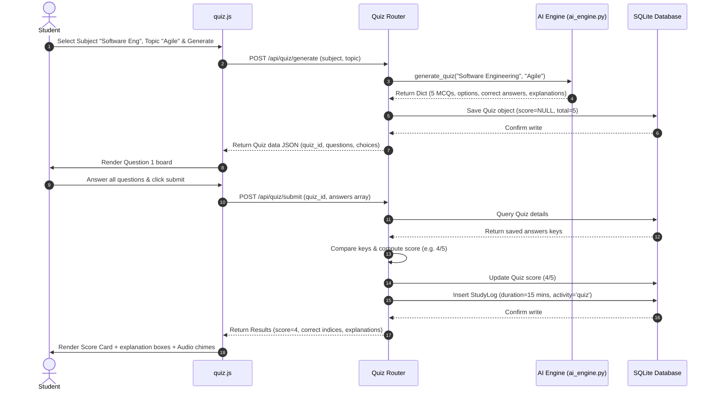

### 2.4 AI Chatbot Flow
This sequence details the chat flow.

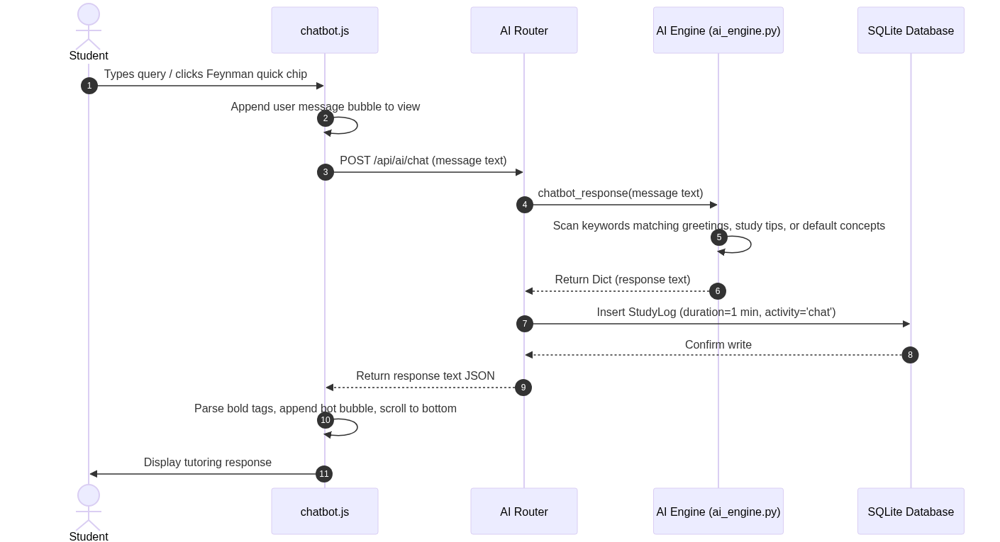

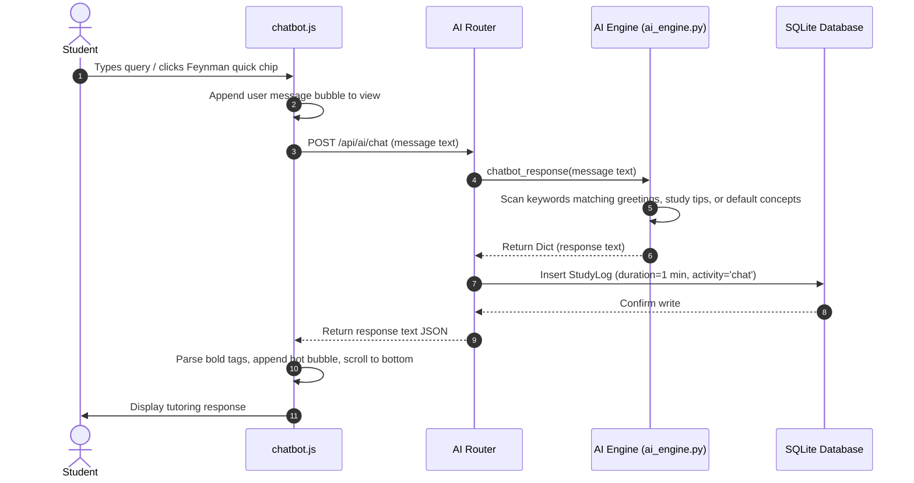

---

## 3. Component Diagram

The component diagram showcases the boundaries between modules, mapping frontend event controllers, API routers, service layers, and the SQLite schema objects.

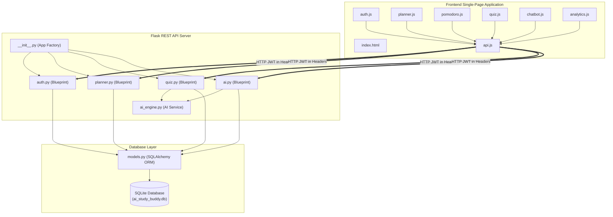

---

## 4. Deployment Diagram

The deployment diagram illustrates the physical hosting configuration, tracing how browsers communicate with Gunicorn on Render, and showcasing the GitHub automated verification runner.

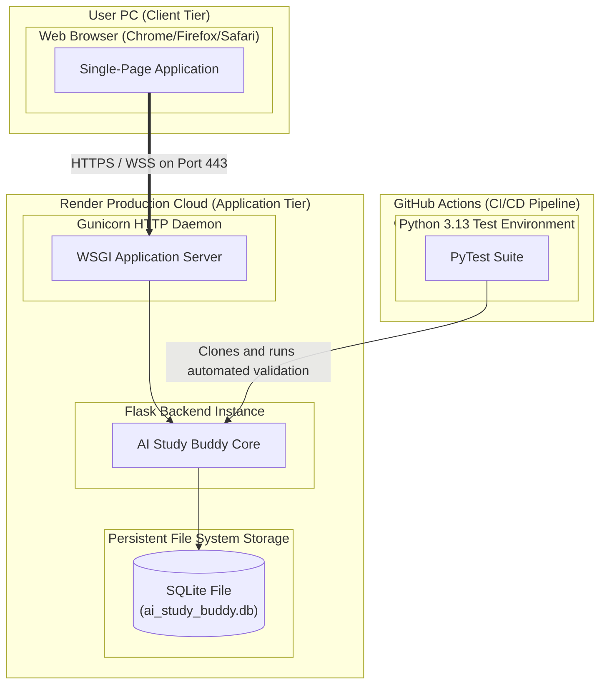
