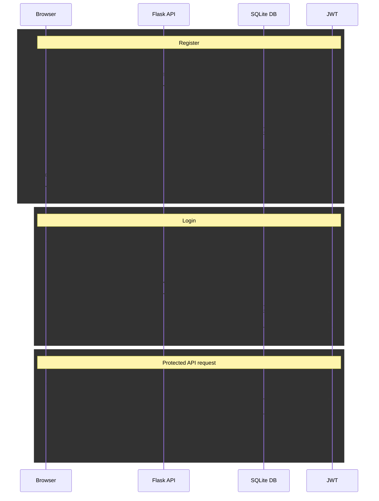

```mermaid
sequenceDiagram
    participant Browser
    participant Flask API
    participant SQLite DB
    participant JWT

    rect rgb(50, 50, 50)
    Note over Browser,JWT: Register
    Browser->>Flask API: POST /register {username, password}
    Flask API->>Flask API: hash password
    Flask API->>SQLite DB: INSERT user row
    SQLite DB-->>Flask API: user_id
    Flask API->>JWT: sign({user_id})
    JWT-->>Flask API: JWT token
    Flask API-->>Browser: 201 Created + JWT
    Browser->>Browser: store in localStorage
    end

    rect rgb(50, 50, 50)
    Note over Browser,JWT: Login
    Browser->>Flask API: POST /login {email, password}
    Flask API->>SQLite DB: SELECT WHERE email=?
    SQLite DB-->>Flask API: user row
    Flask API->>Flask API: bcrypt.check(pwd, hash)
    Flask API->>JWT: sign({user_id})
    JWT-->>Flask API: JWT token
    Flask API-->>Browser: 200 OK + profile
    end

    rect rgb(50, 50, 50)
    Note over Browser,JWT: Protected API request
    Browser->>Flask API: GET /api/tasks Authorization: Bearer JWT
    Flask API->>JWT: verify(token)
    JWT-->>Flask API: user_id
    Flask API->>SQLite DB: SELECT tasks WHERE user_id=?
    SQLite DB-->>Flask API: tasks[]
    Flask API-->>Browser: 200 JSON tasks
    end
```
