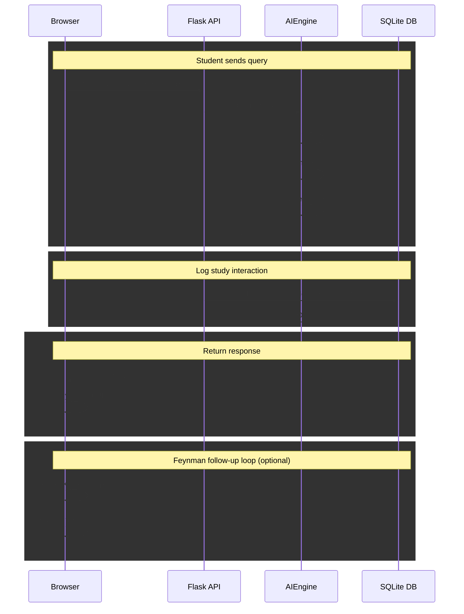

```mermaid
sequenceDiagram
    participant Browser
    participant Flask API
    participant AIEngine
    participant SQLite DB

    rect rgb(50, 50, 50)
    Note over Browser,SQLite DB: Student sends query
    Browser->>Flask API: POST /api/chat {query, history[]}
    Flask API->>AIEngine: chat(query, history)
    AIEngine->>AIEngine: parse intent
    AIEngine->>AIEngine: select heuristic
    AIEngine->>AIEngine: build response
    AIEngine-->>Flask API: reply text
    end

    rect rgb(50, 50, 50)
    Note over Browser,SQLite DB: Log study interaction
    Flask API->>SQLite DB: INSERT study_log (chat, 1 min)
    SQLite DB-->>Flask API: OK
    end

    rect rgb(50, 50, 50)
    Note over Browser,SQLite DB: Return response
    Flask API-->>Browser: 200 {reply, suggestions[]}
    Browser->>Browser: render reply in chat UI
    end

    rect rgb(50, 50, 50)
    Note over Browser,SQLite DB: Feynman follow-up loop (optional)
    Browser->>Browser: student asks follow-up
    Browser-->>Browser: repeats from top
    end
```
