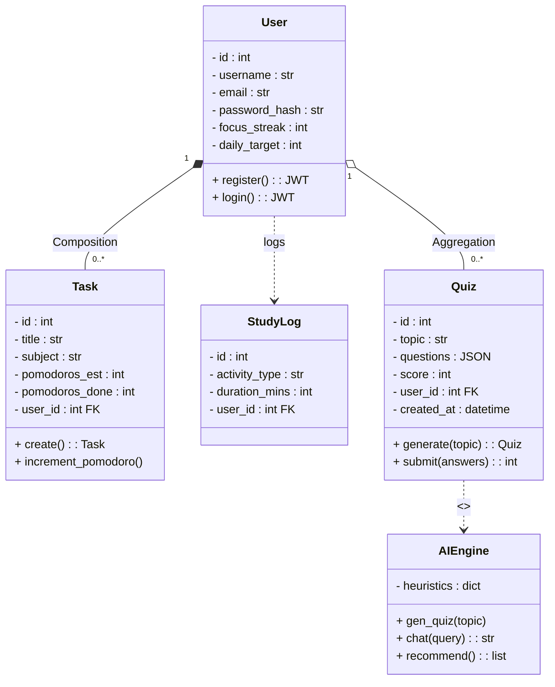

```mermaid
classDiagram
    class User {
        - id : int
        - username : str
        - email : str
        - password_hash : str
        - focus_streak : int
        - daily_target : int
        + register() : JWT
        + login() : JWT
    }
    class Task {
        - id : int
        - title : str
        - subject : str
        - pomodoros_est : int
        - pomodoros_done : int
        - user_id : int FK
        + create() : Task
        + increment_pomodoro()
    }
    class StudyLog {
        - id : int
        - activity_type : str
        - duration_mins : int
        - user_id : int FK
    }
    class Quiz {
        - id : int
        - topic : str
        - questions : JSON
        - score : int
        - user_id : int FK
        - created_at : datetime
        + generate(topic) : Quiz
        + submit(answers) : int
    }
    class AIEngine {
        - heuristics : dict
        + gen_quiz(topic)
        + chat(query) : str
        + recommend() : list
    }

    User "1" *-- "0..*" Task : Composition
    User "1" o-- "0..*" Quiz : Aggregation
    User ..> StudyLog : logs
    Quiz ..> AIEngine : <<uses>>
```
