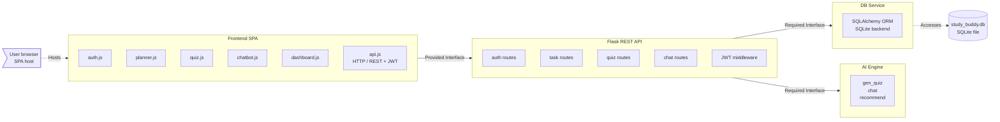

```mermaid
flowchart LR
    %% Definitions
    subgraph FrontendSPA["Frontend SPA"]
        direction TB
        F1[auth.js]
        F2[planner.js]
        F3[quiz.js]
        F4[chatbot.js]
        F5[dashboard.js]
        F6[api.js<br/>HTTP / REST + JWT]
    end

    subgraph FlaskAPI["Flask REST API"]
        direction TB
        B1[auth routes]
        B2[task routes]
        B3[quiz routes]
        B4[chat routes]
        B5[JWT middleware]
    end

    subgraph AIEngineNode["AI Engine"]
        direction TB
        A1[gen_quiz<br/>chat<br/>recommend]
    end

    subgraph DBServiceNode["DB Service"]
        direction TB
        D1[SQLAlchemy ORM<br/>SQLite backend]
    end

    UserBrowser>User browser<br/>SPA host]
    DBFile[(study_buddy.db<br/>SQLite file)]

    %% Connections
    UserBrowser -.->|Hosts| FrontendSPA
    FrontendSPA -- "Provided Interface" --> FlaskAPI
    FlaskAPI -- "Required Interface" --> AIEngineNode
    FlaskAPI -- "Required Interface" --> DBServiceNode
    DBServiceNode -.->|Accesses| DBFile
```
