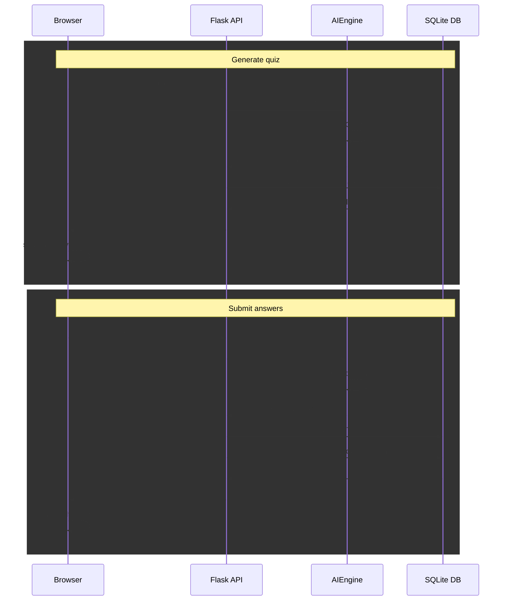

```mermaid
sequenceDiagram
    participant Browser
    participant Flask API
    participant AIEngine
    participant SQLite DB

    rect rgb(50, 50, 50)
    Note over Browser,SQLite DB: Generate quiz
    Browser->>Flask API: POST /api/quiz/generate {topic}
    Flask API->>AIEngine: gen_quiz(topic, n=5)
    AIEngine->>AIEngine: build 5 MCQ questions
    AIEngine-->>Flask API: questions[]
    Flask API->>SQLite DB: INSERT quiz (topic, questions)
    SQLite DB-->>Flask API: quiz_id
    Flask API-->>Browser: 200 quiz + questions
    Browser->>Browser: student answers questions
    end

    rect rgb(50, 50, 50)
    Note over Browser,SQLite DB: Submit answers
    Browser->>Flask API: POST /api/quiz/{id}/submit {answers[]}
    Flask API->>AIEngine: grade(answers, answer_key)
    AIEngine->>AIEngine: compute score
    AIEngine-->>Flask API: score, feedback[]
    Flask API->>SQLite DB: UPDATE quiz SET score=?
    Flask API->>SQLite DB: INSERT study_log (quiz, 15 min)
    SQLite DB-->>Flask API: OK
    Flask API-->>Browser: 200 score + feedback
    Browser->>Browser: render results to student
    end
```
