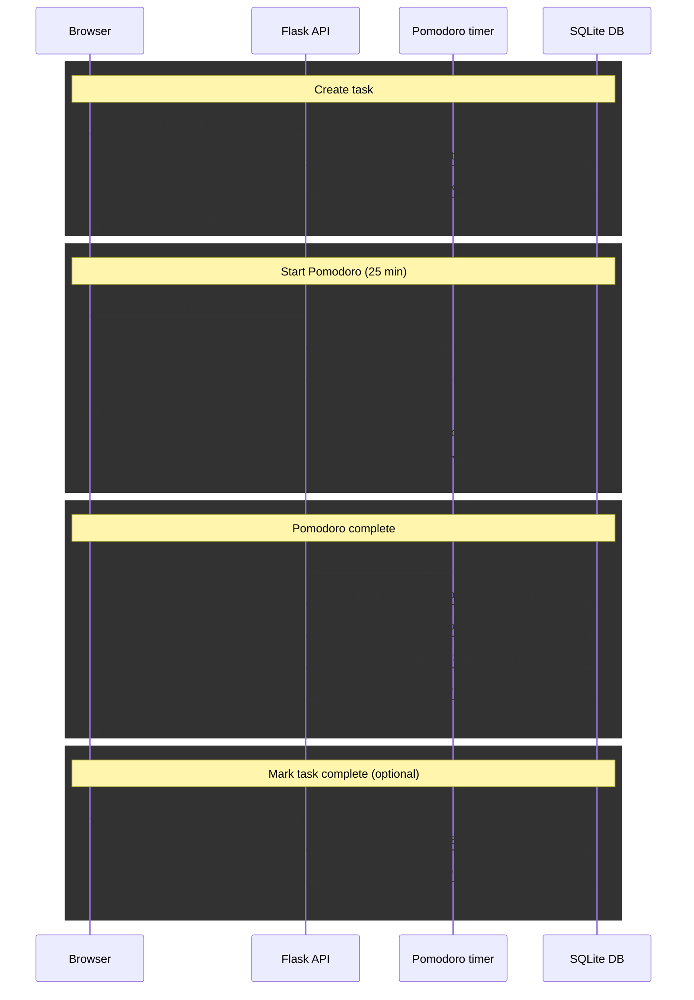

```mermaid
sequenceDiagram
    participant Browser
    participant Flask API
    participant Pomodoro timer
    participant SQLite DB

    rect rgb(50, 50, 50)
    Note over Browser,SQLite DB: Create task
    Browser->>Flask API: POST /api/tasks {title, subject, est}
    Flask API->>SQLite DB: INSERT task row
    SQLite DB-->>Flask API: task_id
    Flask API-->>Browser: 201 Created + task
    end

    rect rgb(50, 50, 50)
    Note over Browser,SQLite DB: Start Pomodoro (25 min)
    Browser->>Flask API: POST /api/tasks/{id}/start
    Flask API->>Pomodoro timer: startTimer(task_id)
    Pomodoro timer-->>Flask API: timer started
    Flask API-->>Browser: 200 OK
    Pomodoro timer->>Pomodoro timer: 25-min countdown
    end

    rect rgb(50, 50, 50)
    Note over Browser,SQLite DB: Pomodoro complete
    Pomodoro timer->>Flask API: onComplete(task_id)
    Flask API->>SQLite DB: UPDATE task SET pomodoros_done+1
    Flask API->>SQLite DB: INSERT study_log (task, 25 min)
    Flask API->>SQLite DB: UPDATE user SET streak+1
    SQLite DB-->>Flask API: OK
    Flask API-->>Browser: pomodoro logged
    end

    rect rgb(50, 50, 50)
    Note over Browser,SQLite DB: Mark task complete (optional)
    Browser->>Flask API: PATCH /api/tasks/{id} {done: true}
    Flask API->>SQLite DB: UPDATE task SET status=done
    SQLite DB-->>Flask API: OK
    Flask API-->>Browser: 200 task updated
    end
```
